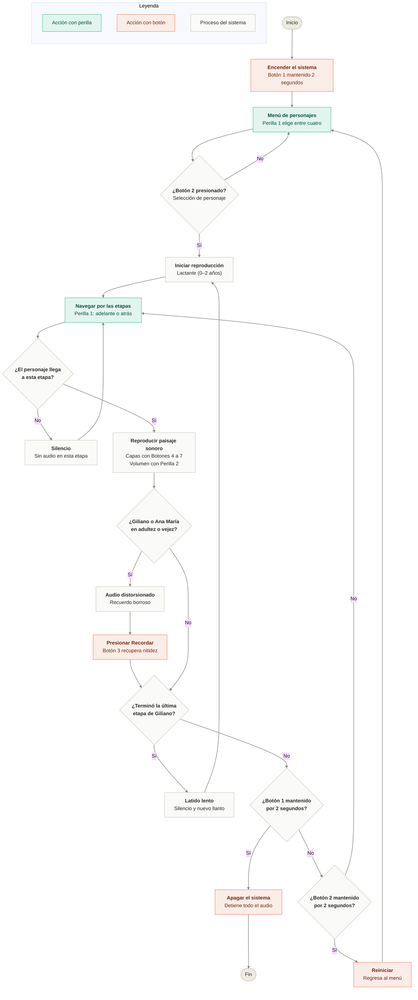
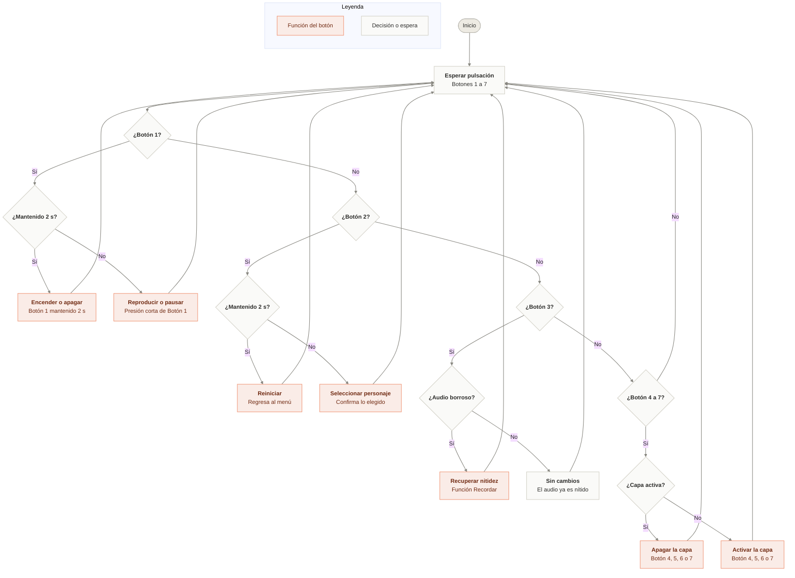
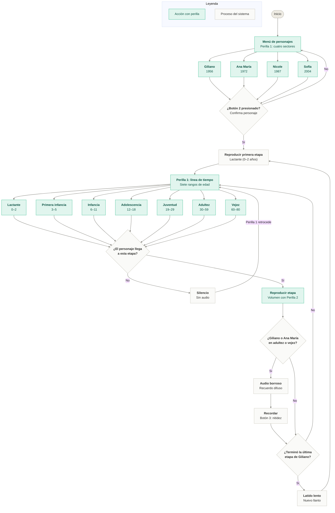

# sesion-14a

## apuntes sesión

Estaba probando si funcionaban los diagramas de flujo

## Diagramas de flujo

<b>Flujo general</b>

```mermaid
%%{init: {'theme':'base','themeVariables':{'fontFamily':'Arial','lineColor':'#888780','primaryTextColor':'#222222'}}}%%
flowchart TD
    A([Inicio]) --> B["<b>Encender el sistema</b><br/>Botón 1 mantenido 2 segundos"]
    B --> C["<b>Menú de personajes</b><br/>Perilla 1 elige entre cuatro"]
    C --> D{"<b>¿Botón 2 presionado?</b><br/>Selección de personaje"}
    D -- No --> C
    D -- Sí --> E["<b>Iniciar reproducción</b><br/>Lactante (0–2 años)"]

    E --> F["<b>Navegar por las etapas</b><br/>Perilla 1: adelante o atrás"]
    F --> G{"<b>¿El personaje llega<br/>a esta etapa?</b>"}
    G -- No --> H["<b>Silencio</b><br/>Sin audio en esta etapa"]
    H --> F
    G -- Sí --> I["<b>Reproducir paisaje sonoro</b><br/>Capas con Botones 4 a 7<br/>Volumen con Perilla 2"]

    I --> J{"<b>¿Giliano o Ana María<br/>en adultez o vejez?</b>"}
    J -- Sí --> K["<b>Audio distorsionado</b><br/>Recuerdo borroso"]
    K --> L["<b>Presionar Recordar</b><br/>Botón 3 recupera nitidez"]
    L --> M
    J -- No --> M{"<b>¿Terminó la última<br/>etapa de Giliano?</b>"}

    M -- Sí --> N["<b>Latido lento</b><br/>Silencio y nuevo llanto"]
    N --> E
    M -- No --> O{"<b>¿Botón 1 mantenido<br/>por 2 segundos?</b>"}

    O -- Sí --> P["<b>Apagar el sistema</b><br/>Detiene todo el audio"]
    P --> Q([Fin])
    O -- No --> R{"<b>¿Botón 2 mantenido<br/>por 2 segundos?</b>"}

    R -- Sí --> S["<b>Reiniciar</b><br/>Regresa al menú"]
    S --> C
    R -- No --> F

    subgraph LEY ["Leyenda"]
        direction TB
        L1["Acción con perilla"]:::perilla
        L2["Acción con botón"]:::boton
        L3["Proceso del sistema"]:::proceso
    end

    classDef inicio fill:#EEEBE3,stroke:#B4B2A9,stroke-width:1px,color:#2C2C2A;
    classDef perilla fill:#E1F5EE,stroke:#5DCAA5,stroke-width:1.5px,color:#085041;
    classDef boton fill:#FAECE7,stroke:#F0997B,stroke-width:1.5px,color:#712B13;
    classDef proceso fill:#FAFAF8,stroke:#D3D1C7,stroke-width:1.5px,color:#2C2C2A;

    class A,Q inicio;
    class B,P,S,L boton;
    class C,F perilla;
    class D,E,G,H,I,J,K,M,N,O,R proceso;

    linkStyle default stroke:#888780,stroke-width:1.5px;
```

<b>Flujo de botones</b>

```mermaid
%%{init: {'theme':'base','themeVariables':{'fontFamily':'Arial','lineColor':'#888780','primaryTextColor':'#222222'}}}%%
flowchart TD
    A([Inicio]) --> B["<b>Esperar pulsación</b><br/>Botones 1 a 7"]

    B --> C{"<b>¿Botón 1?</b>"}
    C -- Sí --> C1{"<b>¿Mantenido 2 s?</b>"}
    C1 -- Sí --> C2["<b>Encender o apagar</b><br/>Botón 1 mantenido 2 s"]
    C1 -- No --> C3["<b>Reproducir o pausar</b><br/>Presión corta de Botón 1"]
    C -- No --> D{"<b>¿Botón 2?</b>"}

    D -- Sí --> D1{"<b>¿Mantenido 2 s?</b>"}
    D1 -- Sí --> D2["<b>Reiniciar</b><br/>Regresa al menú"]
    D1 -- No --> D3["<b>Seleccionar personaje</b><br/>Confirma lo elegido"]
    D -- No --> E{"<b>¿Botón 3?</b>"}

    E -- Sí --> E1{"<b>¿Audio borroso?</b>"}
    E1 -- Sí --> E2["<b>Recuperar nitidez</b><br/>Función Recordar"]
    E1 -- No --> E3["<b>Sin cambios</b><br/>El audio ya es nítido"]
    E -- No --> F{"<b>¿Botón 4 a 7?</b>"}

    F -- Sí --> F1{"<b>¿Capa activa?</b>"}
    F1 -- Sí --> F2["<b>Apagar la capa</b><br/>Botón 4, 5, 6 o 7"]
    F1 -- No --> F3["<b>Activar la capa</b><br/>Botón 4, 5, 6 o 7"]
    F -- No --> B

    C2 --> B
    C3 --> B
    D2 --> B
    D3 --> B
    E2 --> B
    E3 --> B
    F2 --> B
    F3 --> B

    subgraph LEY ["Leyenda"]
        direction TB
        L1["Función del botón"]:::boton
        L2["Decisión o espera"]:::proceso
    end

    classDef inicio fill:#EEEBE3,stroke:#B4B2A9,stroke-width:1px,color:#2C2C2A;
    classDef boton fill:#FAECE7,stroke:#F0997B,stroke-width:1.5px,color:#712B13;
    classDef proceso fill:#FAFAF8,stroke:#D3D1C7,stroke-width:1.5px,color:#2C2C2A;

    class A inicio;
    class C2,C3,D2,D3,E2,F2,F3 boton;
    class B,C,C1,D,D1,E,E1,E3,F,F1 proceso;

    linkStyle default stroke:#888780,stroke-width:1.5px;
```

<b>Flujo de perillas</b>

```mermaid
%%{init: {'theme':'base','themeVariables':{'fontFamily':'Arial','lineColor':'#888780','primaryTextColor':'#222222'}}}%%
flowchart TD
    A([Inicio]) --> B["<b>Menú de personajes</b><br/>Perilla 1: cuatro sectores"]
    B --> P1["<b>Giliano</b><br/>1956"]
    B --> P2["<b>Ana María</b><br/>1972"]
    B --> P3["<b>Nicole</b><br/>1987"]
    B --> P4["<b>Sofía</b><br/>2004"]

    P1 --> C
    P2 --> C
    P3 --> C
    P4 --> C
    C{"<b>¿Botón 2 presionado?</b><br/>Confirma personaje"}
    C -- No --> B
    C -- Sí --> D["<b>Reproducir primera etapa</b><br/>Lactante (0–2 años)"]

    D --> E["<b>Perilla 1: línea de tiempo</b><br/>Siete rangos de edad"]
    E --> T1["<b>Lactante</b><br/>0–2"]
    E --> T2["<b>Primera infancia</b><br/>3–5"]
    E --> T3["<b>Infancia</b><br/>6–11"]
    E --> T4["<b>Adolescencia</b><br/>12–18"]
    E --> T5["<b>Juventud</b><br/>19–29"]
    E --> T6["<b>Adultez</b><br/>30–59"]
    E --> T7["<b>Vejez</b><br/>60–80"]

    T1 --> F
    T2 --> F
    T3 --> F
    T4 --> F
    T5 --> F
    T6 --> F
    T7 --> F
    F{"<b>¿El personaje llega<br/>a esta etapa?</b>"}
    F -- No --> G["<b>Silencio</b><br/>Sin audio"]
    G -- Perilla 1 retrocede --> E
    F -- Sí --> H["<b>Reproducir etapa</b><br/>Volumen con Perilla 2"]

    H --> I{"<b>¿Giliano o Ana María<br/>en adultez o vejez?</b>"}
    I -- Sí --> J["<b>Audio borroso</b><br/>Recuerdo difuso"]
    J --> K["<b>Recordar</b><br/>Botón 3: nitidez"]
    K --> L
    I -- No --> L{"<b>¿Terminó la última<br/>etapa de Giliano?</b>"}

    L -- Sí --> M["<b>Latido lento</b><br/>Nuevo llanto"]
    M --> D
    L -- No --> E

    subgraph LEY ["Leyenda"]
        direction TB
        L1["Acción con perilla"]:::perilla
        L2["Proceso del sistema"]:::proceso
    end

    classDef inicio fill:#EEEBE3,stroke:#B4B2A9,stroke-width:1px,color:#2C2C2A;
    classDef perilla fill:#E1F5EE,stroke:#5DCAA5,stroke-width:1.5px,color:#085041;
    classDef proceso fill:#FAFAF8,stroke:#D3D1C7,stroke-width:1.5px,color:#2C2C2A;

    class A inicio;
    class B,E,P1,P2,P3,P4,T1,T2,T3,T4,T5,T6,T7,H perilla;
    class C,D,F,G,I,J,K,L,M proceso;

    linkStyle default stroke:#888780,stroke-width:1.5px;
```

